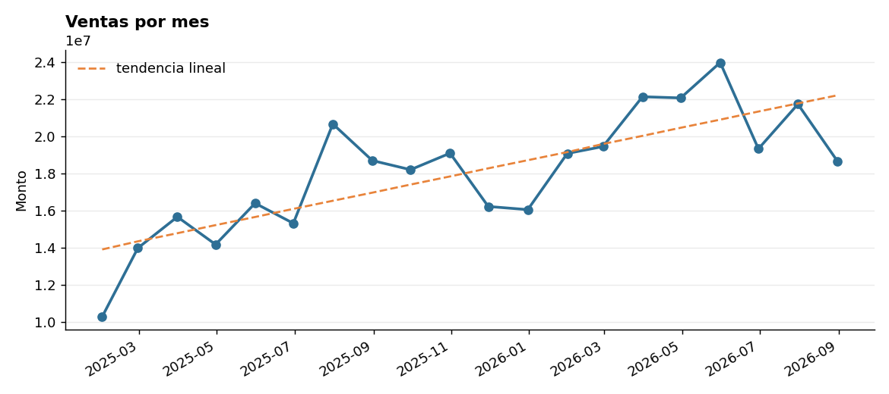
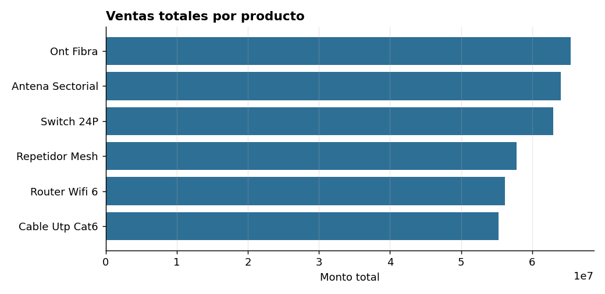
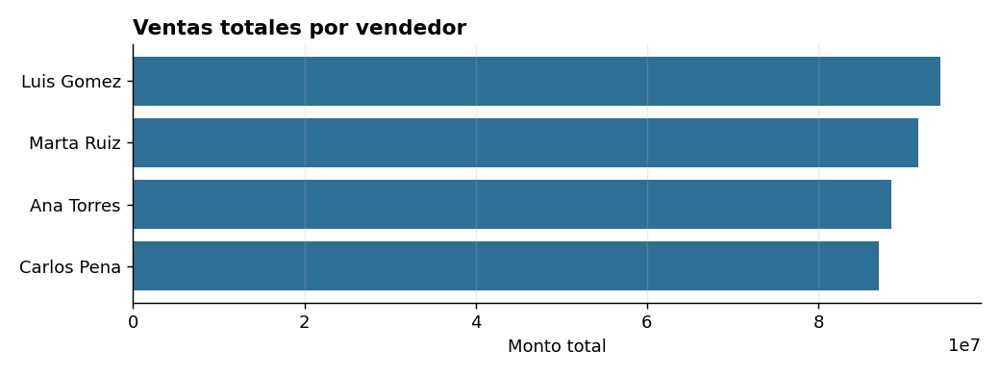
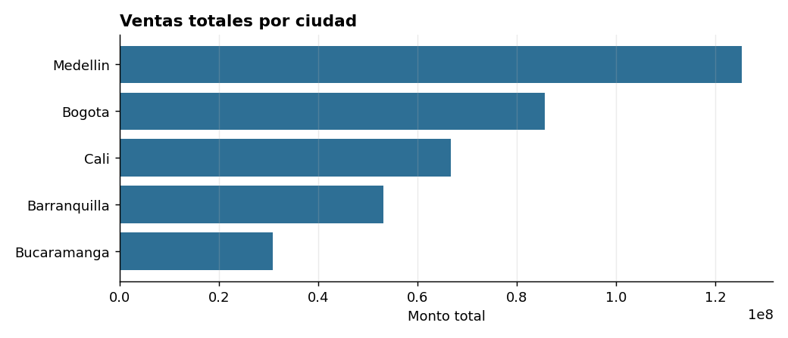
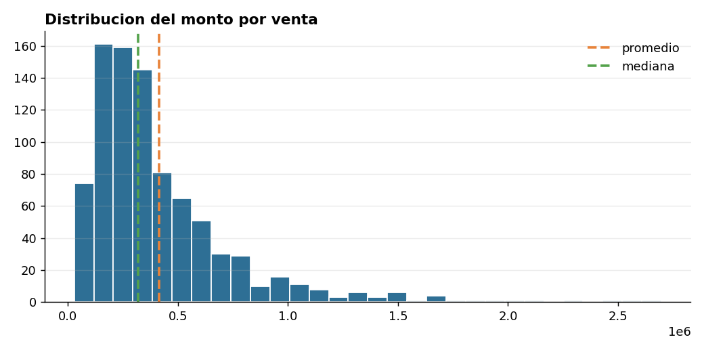

# Informe de analisis de ventas

Generado automaticamente.

## 1. Calidad de los datos

- Columnas normalizadas: ['fecha', 'producto', 'vendedor', 'ciudad', 'cantidad', 'monto']
- Eliminadas 25 filas duplicadas exactas
- 8 fechas ilegibles -> marcadas como nulas
- Eliminadas 8 filas con monto negativo
- Eliminadas 8 filas sin fecha o monto
- Registros: 925 entraron -> 872 quedaron utiles (94.3%)

## 2. Resumen general

| Indicador | Valor |
|---|---|
| Registros analizados | 872 |
| Venta total | $361.587.555 |
| Venta promedio | $414.665 |
| Mediana | $319.086 |
| Desviacion estandar | $341.551 |
| Coeficiente de variacion | 82.4% |
| IC 95% de la media | $391.963 - $437.366 |
| Ventas atipicas detectadas | 57 |

### Como leer esto

- El promedio esta bastante por encima de la mediana: unas pocas ventas grandes estan inflando el promedio. **Para planear, usa la mediana**, que representa mejor la venta tipica.
- La variabilidad es alta (CV 82%): las ventas son muy irregulares entre si. Proyectar con el promedio va a fallar seguido.

## 3. Tendencia

- Tendencia **creciente**: 436.977 por mes en promedio.
- R^2 = 0.60 (la tendencia explica 60% de la variacion mensual).
- p = 0.0001 -> la tendencia es estadisticamente significativa.

## 4. Desempeno por producto

| Producto | Total | Ventas | Promedio |
|---|---|---|---|
| Ont Fibra | $65.384.297 | 147 | $444.791 |
| Antena Sectorial | $63.997.389 | 149 | $429.513 |
| Switch 24P | $62.963.316 | 141 | $446.548 |
| Repetidor Mesh | $57.802.382 | 149 | $387.935 |
| Router Wifi 6 | $56.152.822 | 136 | $412.888 |
| Cable Utp Cat6 | $55.287.349 | 150 | $368.582 |

- **Ont Fibra** concentra el 18% del total.

## 5. Desempeno por vendedor

| Vendedor | Total | Ventas | Promedio |
|---|---|---|---|
| Luis Gomez | $94.319.064 | 238 | $396.299 |
| Marta Ruiz | $91.625.961 | 211 | $434.246 |
| Ana Torres | $88.586.787 | 215 | $412.032 |
| Carlos Pena | $87.055.743 | 208 | $418.537 |

- **Luis Gomez** concentra el 26% del total.

## 6. Desempeno por ciudad

| Ciudad | Total | Ventas | Promedio |
|---|---|---|---|
| Medellin | $125.333.075 | 312 | $401.709 |
| Bogota | $85.671.494 | 203 | $422.027 |
| Cali | $66.729.477 | 159 | $419.682 |
| Barranquilla | $53.091.175 | 116 | $457.683 |
| Bucaramanga | $30.762.334 | 82 | $375.150 |

- **Medellin** concentra el 35% del total.

## 7. Graficas

